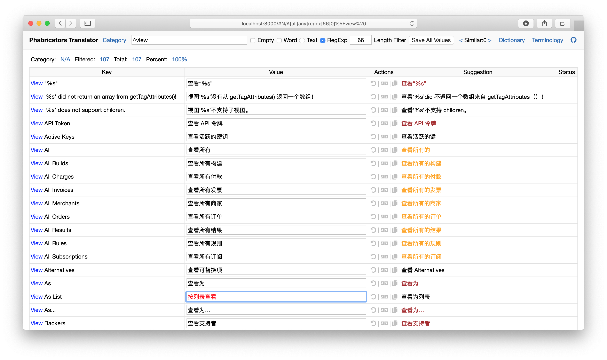

# Phabricator 简体中文翻译（汉化）和工具



## 目录

* [下载地址](#下载地址)
* [翻译进度](#翻译进度)
* [启动翻译工具](#启动翻译工具)
* [编译翻译文件和 README 文件](#编译翻译文件和-readme-文件)
* [本地化 Phabricator](#本地化-phabricator)
* [提取最新 Phabricator 国际化字典资源](#提取最新-phabricator-国际化字典资源)
* [翻译指南](#翻译指南)
* [附录](#附录)
  * [翻译规则列表](Rules.md)
  * [术语表](Terminology.md)
  * [Phabricator 官方国际化文档](https://secure.phabricator.com/book/phabcontrib/article/internationalization/)

## 下载地址

最新版本：[dist/(stable) Promote 2019 Week 50/PhabricatorSimplifiedChineseTranslation.php](dist/(stable)%20Promote%202019%20Week%2050/PhabricatorSimplifiedChineseTranslation.php)

[历史版本列表](dist)

## 翻译进度

当前翻译的 Phabricator 版本：[[c4b4a53cad](https://secure.phabricator.com/rPc4b4a53cad7722f031b725f8b41511e9d341d033)]`(stable) Promote 2019 Week 50`，文件 `data/phabricator/i18n_files.json` 的 SHA1 值：0438bafdec8daa0404cea8c087456c50ab4dc590。

当前翻译的 libphutil 版本：[[1750586](https://secure.phabricator.com/rPHU1750586fdc50a6cd98adba4aa2f5a7649bd91dbe)]`(stable) Promote 2019 Week 39`，文件 `data/phabricator/i18n_files.json` 的 SHA1 值：4e3dc4b0e9e7e459341109261448017ad7646e9e。

当前总词条数量：16428 条，不包含原型应用的总词条数量：14035 条。

当前整体翻译进度百分比：82%。

当前短词条翻译进度百分比：93%。注：短词条为长度小于 66 个字符的词条。

当前不包含原型应用的翻译进度百分比：94%。

分类 | 短词条翻译百分比 | 短词条翻译进度条 | 整体翻译百分比 | 整体翻译进度条
--- | :-----------: | ------------- | :----------: | -----------
aphront | 93% | ========= | 76% | =======
applications/almanac | 97% | ========= | 89% | ========
applications/aphlict | **100%** | ✓✓✓✓✓✓✓✓ | 76% | =======
applications/arcanist | --- |  | --- | 
applications/audit | **100%** | ✓✓✓✓✓✓✓✓ | 91% | =========
applications/auth | 97% | ========= | 73% | =======
applications/badges | 92% | ========= | 92% | =========
applications/base | **100%** | ✓✓✓✓✓✓✓✓ | **100%** | ✓✓✓✓✓✓✓✓
applications/cache | **100%** | ✓✓✓✓✓✓✓✓ | 80% | ========
applications/calendar `原型` | 93% | ========= | 86% | ========
applications/celerity | 93% | ========= | 83% | ========
applications/chatlog `原型` | **100%** | ✓✓✓✓✓✓✓✓ | **100%** | ✓✓✓✓✓✓✓✓
applications/conduit | 99% | ========= | 89% | ========
applications/config | 95% | ========= | 73% | =======
applications/conpherence | **100%** | ✓✓✓✓✓✓✓✓ | **100%** | ✓✓✓✓✓✓✓✓
applications/console | 97% | ========= | 94% | =========
applications/countdown | **100%** | ✓✓✓✓✓✓✓✓ | **100%** | ✓✓✓✓✓✓✓✓
applications/daemon | 99% | ========= | 87% | ========
applications/dashboard | **100%** | ✓✓✓✓✓✓✓✓ | 91% | =========
applications/differential | 91% | ========= | 84% | ========
applications/diffusion | 90% | ======== | 77% | =======
applications/diviner | 75% | ======= | 71% | =======
applications/doorkeeper | 95% | ========= | 82% | ========
applications/draft | --- |  | --- | 
applications/drydock | 87% | ======== | 75% | =======
applications/fact | 83% | ======== | 63% | ======
applications/favorites | **100%** | ✓✓✓✓✓✓✓✓ | **100%** | ✓✓✓✓✓✓✓✓
applications/feed | 98% | ========= | 92% | =========
applications/files | 88% | ======== | 77% | =======
applications/flag | **100%** | ✓✓✓✓✓✓✓✓ | **100%** | ✓✓✓✓✓✓✓✓
applications/fund `原型` | 98% | ========= | 96% | =========
applications/guides | **100%** | ✓✓✓✓✓✓✓✓ | **100%** | ✓✓✓✓✓✓✓✓
applications/harbormaster | 93% | ========= | 81% | ========
applications/help | **100%** | ✓✓✓✓✓✓✓✓ | **100%** | ✓✓✓✓✓✓✓✓
applications/herald | 91% | ========= | 83% | ========
applications/home | **100%** | ✓✓✓✓✓✓✓✓ | **100%** | ✓✓✓✓✓✓✓✓
applications/legalpad | 96% | ========= | 91% | =========
applications/lipsum | **100%** | ✓✓✓✓✓✓✓✓ | 76% | =======
applications/macro | **100%** | ✓✓✓✓✓✓✓✓ | **100%** | ✓✓✓✓✓✓✓✓
applications/maniphest | 99% | ========= | 93% | =========
applications/meta | **100%** | ✓✓✓✓✓✓✓✓ | **100%** | ✓✓✓✓✓✓✓✓
applications/metamta | 92% | ========= | 82% | ========
applications/multimeter `原型` | 94% | ========= | 94% | =========
applications/notification | **100%** | ✓✓✓✓✓✓✓✓ | **100%** | ✓✓✓✓✓✓✓✓
applications/nuance `原型` | 86% | ======== | 82% | ========
applications/oauthserver `原型` | 93% | ========= | 79% | =======
applications/owners | 89% | ======== | 84% | ========
applications/packages `原型` | **100%** | ✓✓✓✓✓✓✓✓ | **100%** | ✓✓✓✓✓✓✓✓
applications/passphrase | **100%** | ✓✓✓✓✓✓✓✓ | 94% | =========
applications/paste | **100%** | ✓✓✓✓✓✓✓✓ | **100%** | ✓✓✓✓✓✓✓✓
applications/people | **100%** | ✓✓✓✓✓✓✓✓ | 91% | =========
applications/phame | **100%** | ✓✓✓✓✓✓✓✓ | **100%** | ✓✓✓✓✓✓✓✓
applications/phid | **100%** | ✓✓✓✓✓✓✓✓ | 78% | =======
applications/phlux `原型` | 96% | ========= | 96% | =========
applications/pholio | **100%** | ✓✓✓✓✓✓✓✓ | **100%** | ✓✓✓✓✓✓✓✓
applications/phortune `原型` | 85% | ======== | 75% | =======
applications/phpast | **100%** | ✓✓✓✓✓✓✓✓ | **100%** | ✓✓✓✓✓✓✓✓
applications/phragment `原型` | 82% | ======== | 77% | =======
applications/phrequent `原型` | **100%** | ✓✓✓✓✓✓✓✓ | **100%** | ✓✓✓✓✓✓✓✓
applications/phriction | 96% | ========= | 96% | =========
applications/phurl `原型` | **100%** | ✓✓✓✓✓✓✓✓ | **100%** | ✓✓✓✓✓✓✓✓
applications/policy | **100%** | ✓✓✓✓✓✓✓✓ | 87% | ========
applications/ponder | **100%** | ✓✓✓✓✓✓✓✓ | **100%** | ✓✓✓✓✓✓✓✓
applications/project | **100%** | ✓✓✓✓✓✓✓✓ | 93% | =========
applications/releeph `原型` | 72% | ======= | 67% | ======
applications/remarkup | **100%** | ✓✓✓✓✓✓✓✓ | **100%** | ✓✓✓✓✓✓✓✓
applications/repository | 84% | ======== | 74% | =======
applications/search | 98% | ========= | 89% | ========
applications/settings | 99% | ========= | 95% | =========
applications/slowvote | **100%** | ✓✓✓✓✓✓✓✓ | **100%** | ✓✓✓✓✓✓✓✓
applications/spaces | 98% | ========= | 88% | ========
applications/subscriptions | **100%** | ✓✓✓✓✓✓✓✓ | **100%** | ✓✓✓✓✓✓✓✓
applications/support | **100%** | ✓✓✓✓✓✓✓✓ | **100%** | ✓✓✓✓✓✓✓✓
applications/system | 94% | ========= | 70% | ======
applications/tokens | **100%** | ✓✓✓✓✓✓✓✓ | **100%** | ✓✓✓✓✓✓✓✓
applications/transactions | 97% | ========= | 83% | ========
applications/typeahead | **100%** | ✓✓✓✓✓✓✓✓ | 94% | =========
applications/uiexample `原型` | 98% | ========= | 98% | =========
applications/xhprof | **100%** | ✓✓✓✓✓✓✓✓ | **100%** | ✓✓✓✓✓✓✓✓
infrastructure | 84% | ======== | 66% | ======
view | **100%** | ✓✓✓✓✓✓✓✓ | 99% | =========

## 启动翻译工具

在当前项目目录执行如下命令：

```sh
$ npm start
```

然后启动浏览器（支持 Chrome 或者 Safari），打开网址 http://localhost:3000 来访问翻译工具。

## 编译翻译文件和 README 文件

在当前项目目录执行如下命令：

```sh
$ npm run compile
```

然后你将得到五份文件：

1. Phabricator 简体中文翻译文件：[`dist/<version>/PhabricatorSimplifiedChineseTranslation.php`](dist/(stable)%20Promote%202019%20Week%2050/PhabricatorSimplifiedChineseTranslation.php)；
2. 重新排序后的翻译数据文件：[`data/translations.json`](data/translations.json)；
3. 包含最新摘要信息的 README 文件：[`README.md`](README.md)；
4. 翻译规则列表文件：[`Rules.md`](Rules.md)；
5. 术语表文件：[`Terminology.md`](Terminology.md)。

## 本地化 Phabricator

将 `dist/<version>/PhabricatorSimplifiedChineseTranslation.php` 文件拷贝到 Phabricator 项目的 `phabricator/src/extensions` 目录中即可。`<version>` 形如："(stable) Promote 2019 Week 46"

然后调整个人设置，进入 `Personal Settings` 的 `Account`，在 `Translation` 选项中选择 `Chinese (Simplified)`，保存后界面即切换为简体中文。

## 提取最新 Phabricator 国际化字典资源

当 Phabricator 项目更新时，会出现新的词条，这时需要提取新的国际化字典资源。

如果您的 Phabricator 项目和本项目处于同级目录，可以直接在当前项目目录执行如下命令：

```sh
$ npm run update
```

您也可以手动进行如下操作：

首先拉取最新的 Phabricator 和 libphutil 源码。在 **Phabricator** 项目路径，执行如下命令：

```sh
$ ./bin/i18n extract
$ ./bin/i18n extract ../libphutil
```

然后你将在 Phabricator 项目的 `/src/.cache/` 目录中找到 `i18n_files.json` 文件，拷贝 `i18n_files.json` 文件到本项目的 `data/phabricator` 目录。

然后你将在 libphutil 项目的 `/src/.cache/` 目录中找到 `i18n_files.json` 文件，拷贝 `i18n_files.json` 文件到本项目的 `data/libphutil` 目录。


## 翻译指南

* 是否翻译为中文的判断；
  * 如果英文意思无法直接表达名称所代表的功能，则不予翻译，保留英文，如 Multimeter 翻译成中文为“万用表”，并不是模块的本意“性能取样器”，所以不予翻译；
  * 开发术语，~~如：Pull 和 Push 等~~；
* 相同的英文单词和词组在同一意思下，尽量使用相同的翻译；
* 相同的英文单词和词组在不同意思下，避免使用相同的翻译；
* 相同结构的英文组合，要使用相同的翻译方法；
* 如果英文表达本身不准确，翻译过程中要予以校准；

## 附录

* [翻译规则列表](Rules.md)
* [术语表](Terminology.md)
* [Phabricator 官方国际化文档](https://secure.phabricator.com/book/phabcontrib/article/internationalization/)
* 感谢 GitHub 提供的关于 Git 术语的[标准翻译](https://help.github.com/cn)。